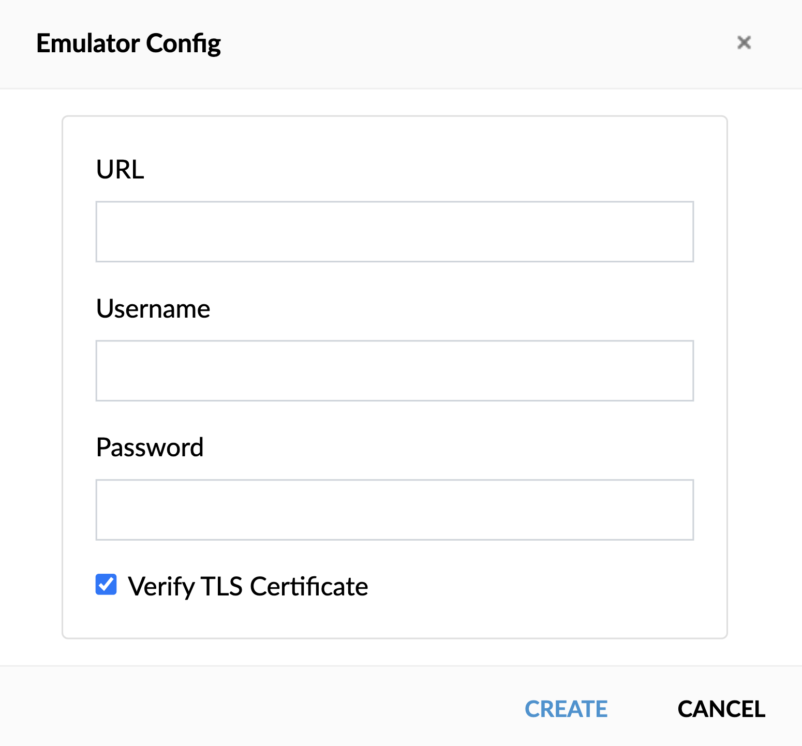
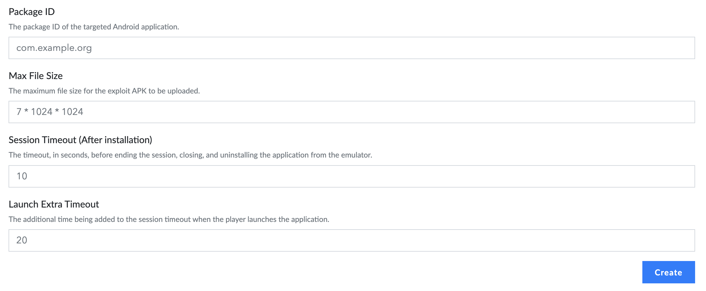
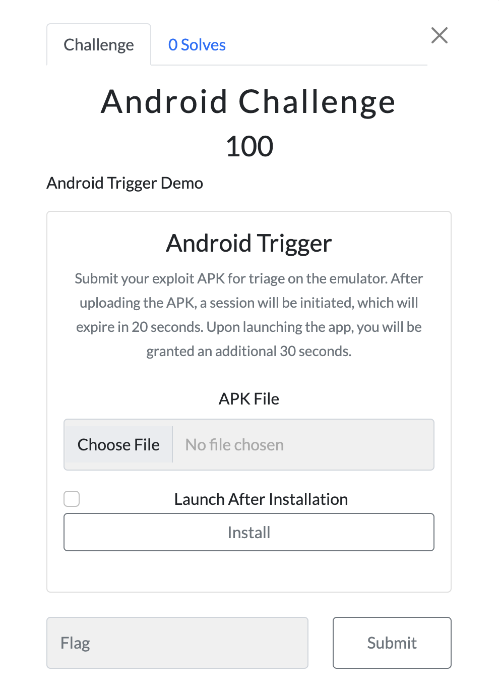
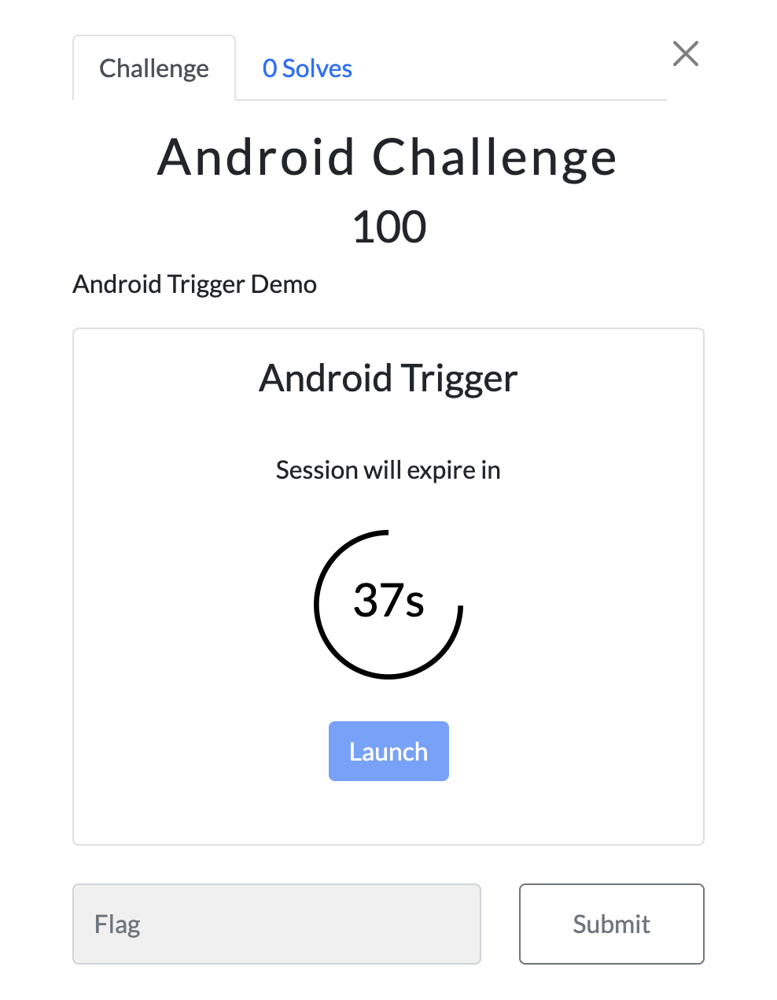

# Android Trigger
A plugin designed for Android challenges in CTFd enables players to automatically triage challenges, particularly those that require the installation of a hostile exploit application on the victim device to exploit the vulnerability. This plugin seamlessly integrates with Genymotion Cloud to provide emulator instances.

## Table of Contents
- [Workflow](#workflow)
- [Installation](#installation)
- [Configuration](#configuration)
- [Add Challenge](#add-challenge)
- [Screenshots](#screenshots)
- [License](#license)

## Workflow
The CTF operator can add a new Android challenge from the Admin Panel, with the option to set both the session timeout and an additional timeout that is added to the session if the player launches the application. When the player attempts to upload their exploit APK, it will undergo parsing and verification to determine its validity. If valid, the APK will then be installed onto an available emulator instance. Once the session times out, both the vulnerable and exploit applications will be exited, and the exploit application will be uninstalled, leaving the emulator instance ready for the next task.

**To-Do, Insha'allah**: Make the workflow dynamically with templates feature.

## Installation
1. Clone this repository.
2. Copy the plugin folder to the `CTFd/plugins` directory.
3. Restart the CTFd server.

## Configuration
1. Navigate to the `Admin Panel` -> `Plugins` (Menu Dropdown) -> `Android Trigger Plugin`.
2. Use the UI Interface to add Genymotion Cloud Emulator configurations.

## Add Challenge
1. Go to `Admin Panel` -> `Challenges` -> `Create Challenge`.
2. Select Challenge Types: android.
3. Fill in the required data for the challenge.

## Screenshots

## License

This project is licensed under the GNU General Public License v3.0 - see the [LICENSE](LICENSE) file for details.
